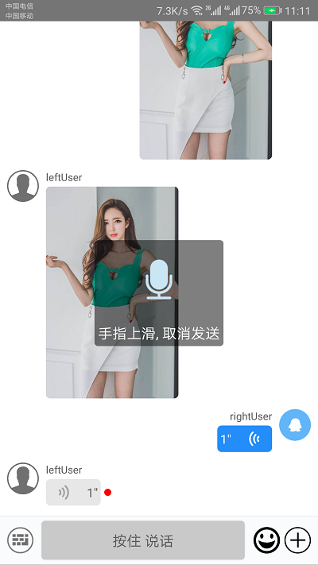
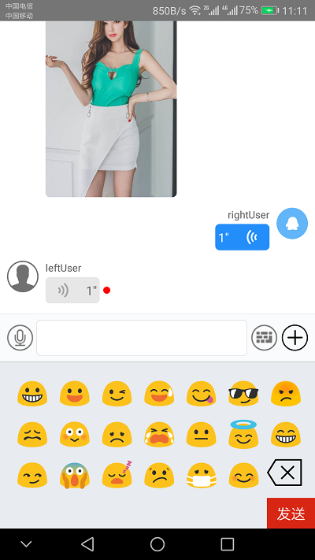
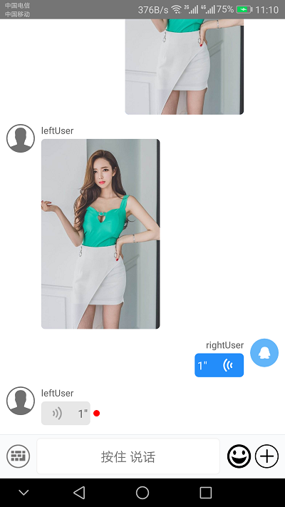
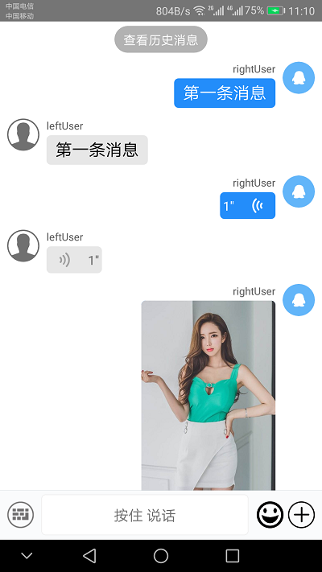

### react-native-chat-ui

#### 简介
一款react native 的聊天UI框架，该框架只是UI层的封装,不做任何IM SDK 的集成，需要IM SDK 的可以自己集成第三方SDK。

#### UI 展示效果






#### 安装
`npm install git+https://github.com/25juan/react-native-chat-ui.git --save`

#### 配置GIF支持
`cmd` 进入`android`目录下,
运行一下命令`gradlew -q app:dependencies`，查看当前RN 的`com.facebook.fresco:fresco:1.3.0`依赖版本是多少，
然后你需要在`android/app/build.gradle`文件中根据需要手动添加以下面的模块,具体的版本号要和上面的查询出来的版本号相对应
```java
dependencies {
  // 如果你需要支持Android4.0(API level 14)之前的版本
  compile 'com.facebook.fresco:animated-base-support:1.3.0' //  

  // 如果你需要支持GIF动图
  compile 'com.facebook.fresco:animated-gif:1.3.0'

  // 如果你需要支持WebP格式，包括WebP动图
  compile 'com.facebook.fresco:animated-webp:1.3.0'
  compile 'com.facebook.fresco:webpsupport:1.3.0'

  // 如果只需要支持WebP格式而不需要动图
  compile 'com.facebook.fresco:webpsupport:1.3.0'
}
```

#### 使用方法
```
import Chat,{ MessageList,MessageInput } from "./react-native-chatui" ;


```
这里导出了`Chat`、`MessageList`、`MessageInput`，建议用Chat 组件就可以了，`MessageList`和`MessageInput`是用来自己
深度定制的组件，Chat 组件将会继承`MessageList`、`MessageInput`的所有属性，并且会把对应的属性放到对应的组件上面。
使用方法参照[example.js](example/example.js)

#### Chat
| 属性   | 含义   |      数据类型      |  默认值 |
|----------|:----------|:-------------:|------:|
| onLoad | Chat 初始化完成之后所执行的回调函数  |  function | (messageList,messageInput)=>{} |

#### MessageList

| 属性   | 含义   |      数据类型      |  默认值 |
|----------|:----------|:-------------:|------:|
| isShowIncomingDisplayName |显示对方的用户名|  boolean | true |
| isShowOutgoingDisplayName |显示自己的用户名|  boolean | false |
| renderMessage|自定义消息渲染 |    function   |   (messageProps)=>{} |
| onLoadMore|下拉加载更多的回调函数 |    function   |   (message)=>{} |
| onMessagePress|点击消息事件 |    function   |   (message)=>{} |
| onFailPress|消息发送失败红色感叹号点击事件 |    function   |   (message)=>{} |
| onMessageLongPress|消息长按事件 |    function   |   (message)=>{} |
| onAvatarPress | 头像点击事件 |  function  | (message)=>{}|
| onScroll|消息列表滚动事件 |    function   |   ()=>{} |
| onPhonePress|消息为电话号码的时候点击事件 |    function   |   (tel)=>{} |
| onUrlPress|消息为url 的时候点击事件 |    function   |   (url)=>{} |
| onEmailPress|消息为电子邮件的时候点击事件 |    function   |   (email)=>{} |
| renderLoadEarlier| 自定义的显示更早之前的消息渲染 |    function   |   (props)=>{} |
| containerStyle| 消息列表一行容器的样式 |    object   |   { left:{ viewProps },right:{ viewProps } } |
| wrapperStyle| bubble样式 |    object   |   { left:{ viewProps },right:{ viewProps } } |
| textStyle| bubble 文本样式 |    object   |   { left:{ viewProps },right:{ viewProps } } |
| canLoadMore |是否显示查看历史消息文字|  boolean | false |
| earlierTextStyle| 查看历史消息 样式 |    object   |   { viewProps } |
| earlierContainerStyle| 查看历史消息 容器样式 |    object   |   { viewProps } |
| earlierWrapperStyle | 包裹文本样式 |    object   |   { viewProps } |
| onLoadMoreAsync | 点击查看历史消息所触发的事件 |    function   |  ()=> {  } |
| isLoadingEarlier | 点击查看历史消息 文本是不是显示一个loading 框 |    boolean |
| onMessageListTouch | 当消息列表手指按下的时候所触发的事件 |    ()=>{} |


| 方法   | 含义   |      参数      |  默认参数 |
|----------|:----------|:-------------:|------:|
| scrollToBottom |滚动到底部|  无 | 无 |
| scrollToTop |滚动到顶部|  无 | 无 |
| appendToTop |追加一条消息到顶部|  message:array | array  |
| appendToBottom |追加一条消息到底部|    message:array   |   array |
| updateMsg |更新消息|    message   |   null |
| deleteMsg |删除消息|    msgid   |   null |


#### MessageInput

| 属性   | 含义   |      数据类型      |  默认值 |
|----------|:----------|:-------------:|------:|
| onHeightChange | 输入框高度变化的函数  |  function | ()=>{} |
| startRecording | 开始录制语音消息回调函数  |  function | ()=>{} |
| stopRecording | 停止录制语音消息回调函数  |  function | (canceled)=>{} |
| onEndReachedRecording | 手指滑动到取消发送的距离的时候触发  |  function | ()=>{} |
| onReachedRecording | 手指滑动时触发的回调函数  |  function | ()=>{} |
| onImagePicker | 输入框工具栏 图片 点击事件回调函数  |  function | ()=>{} |
| onCameraPicker | 输入框工具栏 相机 点击事件回调函数   |  function | ()=>{} |
| onLocationClick | 输入框工具栏 位置 点击事件回调函数   |  function | ()=>{} |
| renderTools | 输入框工具栏 自定义渲染   |  function | (tools)=>{} |


| 方法   | 含义   |      参数      |  默认参数 |
|----------|:----------|:-------------:|------:|
| dismiss |关闭表情选择和工具选择|  无 | 无 |


#### MessageList 数据格式

##### 文本消息数据格式
```javascript
let message = {
    msgId: "msgid", // 消息 id
    status: "send_failed", // 消息状态：send_failed(发送失败)、send_success(发送成功)、send_going(发送中)
    text:"hello world！",//消息文本
    msgType: "text", // 消息类型
    isOutgoing: true,//true 表示当前消息在右边渲染，false 表示当前消息渲染在左边
    fromUser: {
        _id: "", // 用户的id
        name: "sgellar", // 用户名
        avatar: "http://app.yunsdt.com/app/images/wechat-friends.png" // 用户头像
    }
}
```
##### 图片消息数据格式
```javascript
let message = {
    msgId: "msgid", // 消息 id
    status: "send_failed", // 消息状态：send_failed(发送失败)、send_success(发送成功)、send_going(发送中)
    msgType: "image",// 消息类型
    extend:{ 
        imageHeight:80, // 图片在消息列表展示高度
        imageWidth:50,// 图片在消息列表展示宽度
        thumbPath:"http://app.yunsdt.com/app/images/wechat-friends.png",//图片路径(android本地图片需要自带file:/// 前缀) 
   },
    isOutgoing: true,//true 表示当前消息在右边渲染，false 表示当前消息渲染在左边
    fromUser: {
        _id: "", // 用户的id
        name: "sgellar", // 用户名
        avatar: "http://app.yunsdt.com/app/images/wechat-friends.png" // 用户头像
    }
}
```
##### 地理位置消息数据格式
```javascript
let message = {
    msgId: "msgid", // 消息 id
    status: "send_failed", // 消息状态：send_failed(发送失败)、send_success(发送成功)、send_going(发送中)
    title:"四川省成都市", // 地理位置消息显示标题
    msgType: "location", // 消息类型
    isOutgoing: true,//true 表示当前消息在右边渲染，false 表示当前消息渲染在左边
    fromUser: {
        _id: "", // 用户的id
        name: "sgellar", // 用户名
        avatar: "http://app.yunsdt.com/app/images/wechat-friends.png" // 用户头像
    }
}
```      
##### 声音消息数据格式
```javascript
let message = {
    msgId: "msgid", // 消息 id
    status: "send_failed", // 消息状态：send_failed(发送失败)、send_success(发送成功)、send_going(发送中)
    playing:true, // 表示消息是不是在播放中
    duration:1000, // 声音时长(单位ms)
    msgType: "voice", // 消息类型
    isRead:false,// 表示消息未读、true 表示已读
    isOutgoing: true,//true 表示当前消息在右边渲染，false 表示当前消息渲染在左边
    fromUser: {
        _id: "", // 用户的id
        name: "sgellar", // 用户名
        avatar: "http://app.yunsdt.com/app/images/wechat-friends.png" // 用户头像
    }
}
```      


